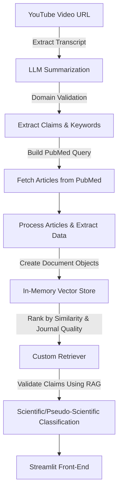

# AI-Powered YouTube Claim Validator with PubMed Integration

## Overview
This project showcases an end-to-end Generative AI app that extracts, processes, and validates claims made in YouTube videos related to **medicine**, **fitness**, and **health**. This product analyzes youtube video transcripts, verifies claims against scientific literature, and determines if the claims are **scientific** or **pseudo-scientific**. The ultimate goal is to use AI to make people aware of pseudo-scientific advice being peddled by youtube influencers and provide evidence based validation of claims.

Key highlights include:
- Transcript **summarization** and domain validation using LLMs.
- Article retrieval and processing from **PubMed**.
- A customized ranking of articles based on **relevance** and **journal quality** (SCImago Journal Rank).
- Retrieval-Augmented Generation (RAG) for claim assessment.
- **Streamlit** integration for an interactive front-end.

## Features
### 1. Transcript Extraction and Summarization
- Input: A YouTube video URL.
- **Transcript extraction** is performed using automated tools.
- Summarization of transcripts using state-of-the-art LLMs (e.g., GPT-4o-mini).

### 2. Domain Validation
- LLM-based domain check to ensure the transcript pertains to **medicine**, **health**, or **fitness**.
- Irrelevant content is filtered out.

### 3. Claim Extraction and Keyword Identification
- Extract **key claims** and **keywords** from the transcript.
- These claims serve as the basis for scientific validation.

### 4. PubMed Query and Article Retrieval
- Build PubMed queries using extracted keywords and optional date ranges.
- Fetch relevant articles asynchronously using `Entrez.esearch`.
- For each query:
  - Fetch article **titles, abstracts**, and **journal names**.
  - If available, retrieve **PMCIDs** (free full-text articles).
  - Extract conclusions for full-text articles.
- Organize results into a Pandas **DataFrame**.

### 5. Claim Validation and Ranking
- Convert the DataFrame into **LangChain document objects** for processing.
- On-the-fly **vector embedding** creation using an in-memory vector store (no persistence).
- Implement a **custom retriever**:
  - Rank documents based on **cosine similarity** to the claim.
  - Adjust rankings using **SCImago Journal Rank** to prioritize articles from reputable journals.
- Use Retrieval-Augmented Generation (RAG) to validate claims.

### 6. Scientific or Pseudo-Scientific Classification
- Assess the claims made in the video by referencing scientific literature.
- Generate outputs indicating whether claims are **scientific** or **pseudo-scientific** or **partially correct**, with supporting evidence.
- Outputs include:
  - Claim summary
  - Validation result (scientific/pseudo-scientific)
  - Supporting research summary.

### 7. Front-End (Streamlit)
- A user-friendly **Streamlit** interface for inputting YouTube video links, viewing results, and exploring claim assessments.

## Architecture


## Tech Stack
- **Python**
- **LangChain**: For Retrieval-Augmented Generation (RAG) and document processing.
- **OpenAI GPT-4o-mini** / **Google Gemini**: For summarization, claim extraction, and validation.
- **aiohttp**: Asynchronous requests for PubMed API.
- **Biopython**: Integration with PubMed's `Entrez` API.
- **Pandas and numpy**: For data manipulation and processing.
- **nltk**: Natural Language toolkit for text analysis
- **Streamlit**: Interactive front-end.

## How It Works
### Input:
- A YouTube video link related to medicine, fitness, or health.

### Output:
- Validation of key claims in the video as **scientific** or **pseudo-scientific**.
- Supporting evidence with research summary.

## Setup and Installation
1. Clone the repository:
   ```bash
   git clone <repo-link>
   cd <repo-directory>
   ```
2. Install dependencies:
   ```bash
   pip install -r requirements.txt
   ```
3. Run the Streamlit app:
   ```bash
   streamlit run app.py
   ```
4. Access the app at `http://localhost:8501`.

## Configuration
- Ensure you have an **OpenAI API key**,   **Gemini API key** and **PubMed API key**.


## Future Enhancements
- Implement caching for frequently queried claims.
- Add support for multi-language YouTube transcripts.
- Integrate other reliable research databases.
- Improve claim extraction using fine-tuned models.

## Acknowledgements
- [LangChain](https://github.com/langchain-ai/langchain)
- [SCImago Journal Rank](https://www.scimagojr.com/)
- [PubMed API Documentation](https://www.ncbi.nlm.nih.gov/home/develop/api/)
- OpenAI and Google for their LLMs.

## License
This project is licensed under the MIT License.

---

## Demo Screenshots
### Claim Validation Demo:


---

Feel free to contribute, raise issues, or suggest improvements. Happy coding! 🚀


